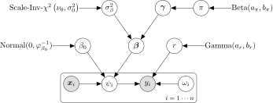

# Scalable Bayesian Variable Selection for Negative Binomial Regression Models

## Introduction
We focus on Bayesian variable selection methods for regression models for count data, and specifically on the negative binomial  linear regression model. We first formulate a Bayesian hierarchical model with a variable selection *spike-and-slab* prior. For posterior inference, we review standard MCMC methods and investigate a computationally more efficient approach using variational inference. We also compare performance of the *spike-and-slab* prior versus an adaptive shrinkage prior such as the horseshoe prior.

The negative binomial regression is specified as the following given 

<p align="center"></p>

We implemented the sparsity-inducing *spike-and-slab* prior and adaptive shrinkage horseshoe prior.

**The hierarchical priors are specified for the *spike-and-slab* setting:**
<p align="center"></p>

**The hierarchical priors are specified for the *horseshoe* setting:**
<p align="center"></p>

**The priors on the other parameters are given as**
<p align="center"></p>

**The direct graph under the *spike-and-slab* setting is** 

<p align="center">

</p>


## Installation
### Prepare environment

Our code is written in C/C++ and use the pybind11 to expose the C++ to Python. We use the Eigen and GSL packages for fast linear algebra and random sampling computation. Therefore, to use our code, we need to install a few dependent software and set up the necessary environment. Here is a list of software that need to install before running our code. 

- [x] Python 2 or 3
- [x] [pybind11](https://github.com/pybind/pybind11)
- [x] g++
- [x] git
- [x] cmake
- [x] [GSL](https://www.gnu.org/software/gsl/)
- [x] [Eigen](http://eigen.tuxfamily.org/index.php?title=Main_Page)

Configuring those environment correctly can be a pain. But don't worry, I will walk you through the process in detail. For the following tutorial, I will use **Ubuntu** as an example. For the other Linux based system such as macOS or Red Hat, the process should be similar. But the process for setting up the environment in Windows is more confusing and you might need to install [Microsoft Visual Studio](https://visualstudio.microsoft.com/) and its package manager [vcpkg](https://github.com/Microsoft/vcpkg). However, I am currently working on an R package that can hopefully solve the compatibility issues with the Windows. Please visit us again and check our R package in the future.

**Install Python**

You can install either Python 2 or Python 3 using [Anaconda](https://www.anaconda.com/distribution/) or [Miniconda](https://docs.conda.io/en/latest/miniconda.html). 

**Install the pybind11**

```shell
pip install pybind11
```
**Install gcc and g++**
```shell
sudo apt-get install build-essential
```
**Install git**
```shell
sudo apt install git
```
**Install cmake** Check the answer [here](https://askubuntu.com/questions/610291/how-to-install-cmake-3-2-on-ubuntu) for an alternative way.
```shell
sudo apt-get install software-properties-common
sudo add-apt-repository ppa:george-edison55/cmake-3.x
sudo apt-get update
sudo apt-get install cmake
```
**Install GSL**

```shell
sudo apt-get install libgsl-dev
```

**Install Eigen**

```shell
sudo apt-get install libeigen3-dev
```

**Compile csnbvbs**

```shell
cmake . -DCMAKE_BUILD_TYPE=Release
make
```
You will find a file named **csnbvbs.cpython-36m-x86_64-linux-gnu.so** in the current directory. 
Copy the **csnbvbs**file  to the directory that you are working with. You are ready to import it as a regular python package. Congratulations!

## Example

There are four modules from this package:

- [x] NegBinHS (MCMC version with the horseshoe prior)
- [x] NegBinSSMCMC (MCMC version with the *spike-and-slab* prior)
- [x] NegBinSSVIEM (Variaional Inference EM with the *spike-and-slab* prior)
- [x] parNegBinSSVIIS (Variaional Inference EM and Importance Sampling with the *spike-and-slab* prior)

You can copy the **csnbvbs** file to the scripts folder and perform the following benchmark testing among four methods considered:

Simulate n = 200, p = 50 with various model sparsity level and features correlation measure rho.
```bash
python py_simulation.py
```
After running the **py_simulation.py**, you will find a simulation folder where there are 100 examples per folder with different rho. You then can perform benchmark study by running the following python scripts:


```shell
python py_ss_mcmc_benchmark.py # spike and spike mcmc sampling
python py_hs_benchmark.py      # horseshoe mcmc sampling
pyhton py_ss_viem_benchmark.py # variational inference EM
pyhton py_ss_viss_benchmark.py # variational inference EM with importance sampling
```


### MCMC Implementations

1. [Horseshoe MCMC](tutorial/horseshoe.md)
2. 

